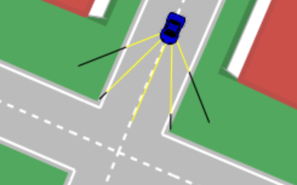
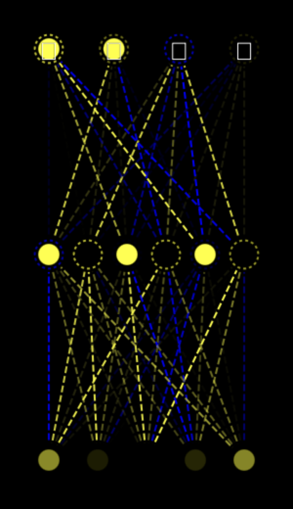
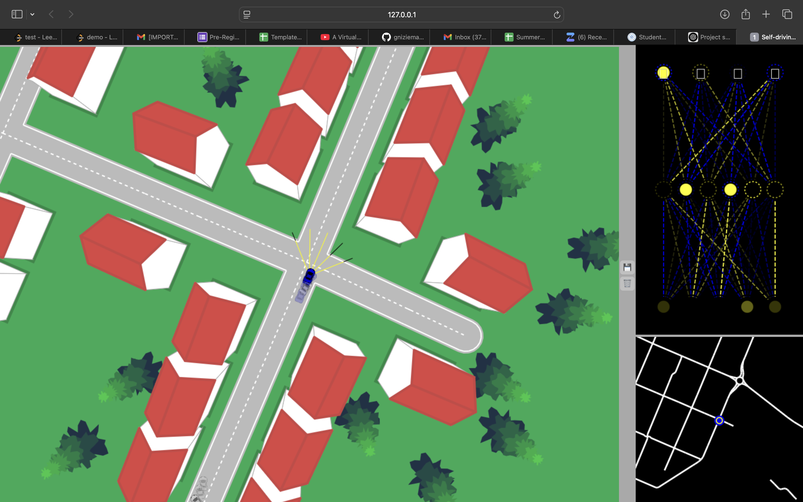

# Self-Driving Car Simulation

A JavaScript implementation of a self-driving car simulation using neural networks, built without external libraries. This project demonstrates various autonomous driving components from basic car mechanics to advanced neural network optimization.

## Project Overview

This simulation implements a comprehensive self-driving car system, featuring:
- Neural network-based decision making
- Real-time sensor systems
- Advanced collision detection
- Traffic simulation
- Visual debugging tools

## Technology Stack
- **Frontend**: HTML5, JavaScript
- **Rendering**: HTML5 Canvas API
- **AI/ML**: Custom Neural Network implementation
- **No external libraries/frameworks used**

## Project Components

### Core Components

1. **Car Mechanics (`car.js`)**
   - Vehicle physics simulation
   - Movement controls and dynamics
   - Polygon-based collision boundaries

2. **Road System (`road.js`)**
   - Lane definitions and boundaries
   - Road marking visualization
   - Environmental constraints

3. **Sensor System (`sensor.js`)**
   - Ray-casting implementation
   - 8-directional obstacle detection
   - Real-time distance measurements
   - Traffic and border detection

4. **Neural Network (`network.js`)**
   - Custom neural network architecture
   - Forward propagation
   - Network visualization tools
   - Weight optimization algorithms

5. **Traffic Simulation (`traffic.js`)**
   - Multiple vehicle management
   - Realistic traffic patterns
   - Collision avoidance logic

### Supporting Components

6. **Controls (`controls.js`)**
   - Keyboard input handling
   - Manual override capabilities
   - Dummy controls for AI training

7. **Utils (`utils.js`)**
   - Intersection detection algorithms
   - Linear algebra utilities
   - Helper functions for calculations

8. **Visualizer (`visualizer.js`)**
   - Neural network state visualization
   - Real-time network activity display
   - Debug information rendering

## Key Features

- Real-time simulation with 90% navigation success rate
- Optimized polygon intersection algorithms
- Live neural network visualization
- Advanced collision prevention system
- Traffic simulation with multiple autonomous agents

## Setup and Running

1. Clone the repository
2. Open `index.html` in a modern web browser
3. Use arrow keys for manual control or enable AI mode

## Project Structure
self-driving-car/ ├── index.html # Main entry point ├── style.css # Basic styling ├── src/ │ ├── car.js # Car mechanics │ ├── road.js # Road definition │ ├── sensor.js # Sensor implementation │ ├── network.js # Neural network │ ├── traffic.js # Traffic simulation │ ├── controls.js # Input handling │ ├── utils.js # Utility functions │ └── visualizer.js # Network visualization

## Development Phases

1. Car driving mechanics
2. Road definition
3. Artificial sensors
4. Collision detection
5. Traffic simulation
6. Neural network
7. Visualizing neural networks
8. Optimizing neural networks
9. Fine-tuning
10. Live stream variant

## Screenshots

### Car and Sensor Visualization

*Visualization of the car's sensor system with ray casting*

### Neural Network Display

*Real-time visualization of the neural network's decision making*

### Full Simulation View

*Complete view of the self-driving car simulation in action*

## Performance Optimization

- Efficient collision detection algorithms
- Optimized sensor calculations
- 40% reduction in computational overhead
- Smooth real-time visualization

## Future Enhancements

- Multiple lane support
- Advanced traffic patterns
- Enhanced neural network architectures
- More environmental variables
